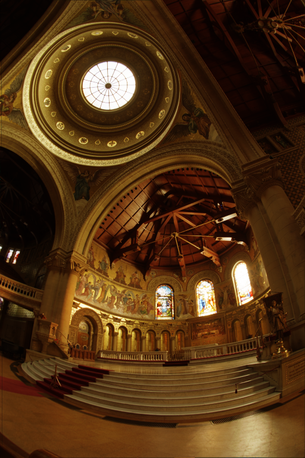

# PhyxRadpp

PhyxRadpp is a modern C++23 ray tracer and image processing utility. Built with performance and modern standards in mind, the project heavily utilizes C++23 modules and the `xmake` build system.

Currently, the engine is capable of processing High Dynamic Range (HDR) images and rendering 3D scenes featuring perspective cameras and mathematical shapes (such as spheres and planes).

## Features

* **PFM to PNG Conversion:** Converts HDR `.pfm` image files into standard `.png` files. Includes customizable exposure scaling (alpha factor) and gamma correction.
* **Basic Ray Tracing Demo:** Renders a 3D scene containing multiple geometric primitives (spheres, cubes). Calculates ray-object intersections from a perspective camera, outputting a black-and-white silhouette map of the hits.
* **Modern C++23 Architecture:** Fully modularized codebase (`.cppm` files), utilizing the newest features like `std::expected` for safe error handling.

## Quick Start (Building & Running)

If your system is already set up with a modern C++ compiler, building the project is incredibly simple. Navigate to the folder containing `xmake.lua` and run:
```bash
xmake
```

### Usage
The executable PhyxRadpp has two main commands: `pfm2png` and `demo`.

### 1. PFM to PNG Converter
Converts an HDR image into a standard PNG.

```bash
xmake run PhyxRadpp pfm2png <INPUT_PFM> <ALPHA_FACTOR> <GAMMA> <OUTPUT_PNG>
```

(Example: `xmake run PhyxRadpp pfm2png <image_path>.pfm 0.2 2.2 <output_name>.png`)

Here is the result of the conversion of `images/memorial.pfm` into `memorial_alpha0.2_gamma_1.png`
The following command

```bash
xmake run PhyxRadpp pfm2png images/memorial.pfm 0.2 1.0 memorial
```




### 2. Ray Tracing Demo
Renders a hard-coded black-and-white 3D scene. To run it and output a file named demo.png with an alpha of 1 and gamma of 1, use:

```bash
xmake run PhyxRadpp demo 1 1 demo
```
Here is the demo result


### Testing
To build and run the `doctest` unit test suite, simply use:

```bash
xmake test -v
```
Each `.cppm` file has its own tests: to build and run tests for a specific `.cppm` file run
```bash
xmake run test_<FILE_NAME>
```
(Example for `HDRImage`: `xmake run test_HDRImage`)

### First Time Setup (Dependencies)
If you are compiling this project on a fresh machine, you need a C++23 compatible compiler. `xmake` will automatically download `doctest` and `stb`, but you must provide the compiler.

### 🐧 Linux (Ubuntu)
You need Clang 18 and libc++ for C++23 modules support. Run these commands once:

```bash
sudo apt-get update
sudo apt-get install -y clang-18 libc++-18-dev libc++abi-18-dev clang-tools-18
xmake config --yes --toolchain=clang
```

### 🍎 macOS
Install the official LLVM via Homebrew (Apple Clang lacks full module support):

```bash
brew update
brew install llvm
xmake config --yes
```

### 🪟 Windows
Visual Studio 2022 (MSVC) is fully supported and detected automatically. Just run xmake.
