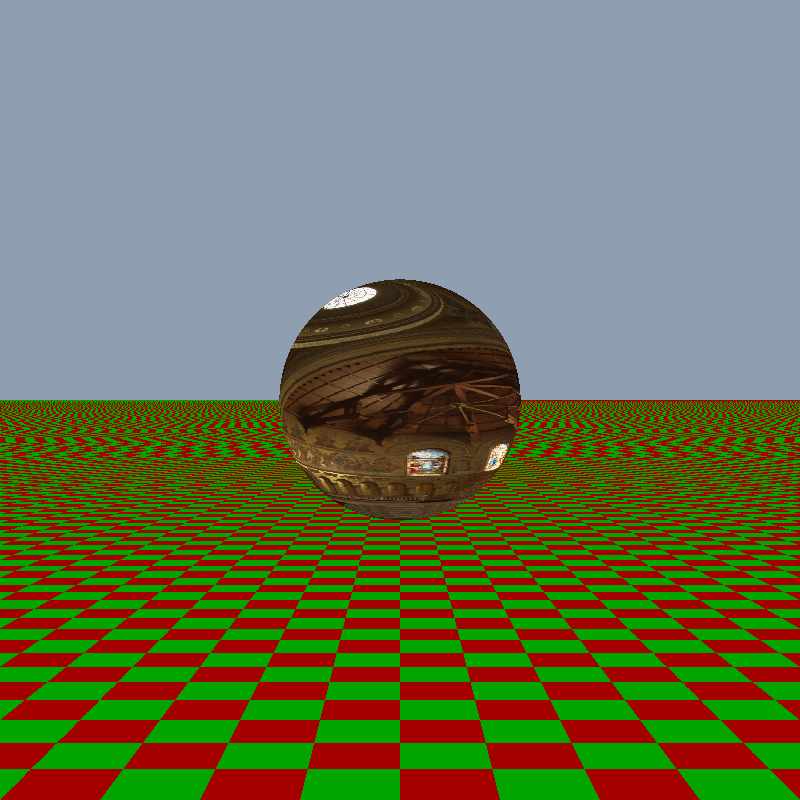
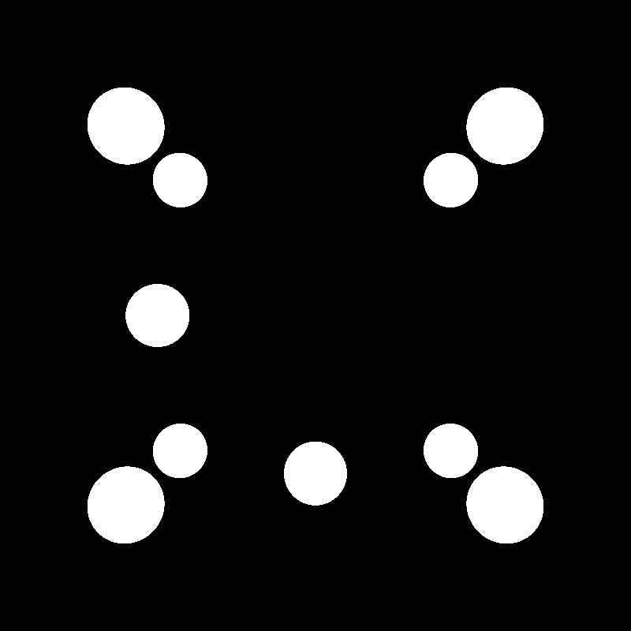

# PhyxRadpp

PhyxRadpp is a modern C++23 ray tracer and image processing utility. Built with performance and modern standards in mind, the project heavily utilizes C++23 modules and the `xmake` build system.

Currently, the engine is capable of processing High Dynamic Range (HDR) images and rendering 3D scenes featuring perspective cameras and mathematical shapes (such as spheres and planes).

## Features

* **PFM to PNG Conversion:** Converts HDR `.pfm` image files into standard `.png` files. Includes customizable exposure scaling (alpha factor) and gamma correction.
* **Modular Material System:** Features an extensible architecture for materials and BRDFs. Includes support for UniformPigment (solid colors), CheckeredPigment (procedural grids), and ImagePigment (HDR texture mapping).
* **Multi-Algorithm Ray Tracing:** Renders 3D scenes using interchangeable algorithms. Currently supports:
  - onoff: A fast silhouette map of ray-object intersections (default black and white image).
  - flat: A flat-shading renderer that resolves surface parameters (UV coordinates) to apply colors and image textures.
* **Modern C++23 Architecture:** Fully modularized codebase (`.cppm` files), utilizing the newest features like `std::expected` for safe error handling.

## Quick Start (Building & Running)

If your system is already set up with a modern C++ compiler, building the project is incredibly simple. Navigate to the folder containing `xmake.lua` and run:
```bash
xmake
```

### Usage
The executable PhyxRadpp has two main commands: `pfm2png` and `demo`.

### 1. PFM to PNG Converter
Converts an HDR image into a standard PNG.

```bash
xmake run PhyxRadpp pfm2png <INPUT_PFM> <ALPHA_FACTOR> <GAMMA> <OUTPUT_PNG>
```

#### -- Example 1.1: Conversion from `.pfm` to `.png`
Here is a command that converts `images/memorial.pfm` into `memorial_alpha0.2_gamma_1.png`

```bash
xmake run PhyxRadpp pfm2png images/memorial.pfm 0.2 1.0 memorial
```


### 2. Ray Tracing Demo
Renders a 3D scene. You can optionally specify the rendering algorithm using the `--algorithm` flag (defaults to `flat`).

```bash
xmake run PhyxRadpp demo <ALPHA_FACTOR> <GAMMA> <OUTPUT_PNG> [--algorithm <onoff|flat>]
```
#### -- Example 2.1: Textured Scene (Flat Shading)
To render a scene with a textured sphere and a checkered plane using an `alpha=0.3` and `gamma=2.2`:

```bash
xmake run PhyxRadpp demo 0.3 2.2 sphere_plane --algorithm flat
```




#### -- Example 2.2: Silhouette Mode (On/Off)
To render a black-and-white silhouette of the geometry:

```bash
xmake run PhyxRadpp demo 1 1 demo_silhouette --algorithm onoff
```



*Note: if you use the default settings for OnOffRenderer the values of `alpha` and `gamma` are irrelevant. Be careful to set sensible values of `alpha` and `gamma` when you render different colors.*

### Testing
To build and run the `doctest` unit test suite, simply use:

```bash
xmake test -v
```
Each `.cppm` file has its own tests: to build and run tests for a specific `.cppm` file run
```bash
xmake run test_<FILE_NAME>
```
(Example for `HDRImage`: `xmake run test_HDRImage`)

### First Time Setup (Dependencies)
If you are compiling this project on a fresh machine, you need a C++23 compatible compiler. `xmake` will automatically download `doctest` and `stb`, but you must provide the compiler.

### 🐧 Linux (Ubuntu)
You need Clang 18 and libc++ for C++23 modules support. Run these commands once:

```bash
sudo apt-get update
sudo apt-get install -y clang-18 libc++-18-dev libc++abi-18-dev clang-tools-18
xmake config --yes --toolchain=clang
```

### 🍎 macOS
Install the official LLVM via Homebrew (Apple Clang lacks full module support):

```bash
brew update
brew install llvm
xmake config --yes
```

### 🪟 Windows
Visual Studio 2022 (MSVC) is fully supported and detected automatically. Just run xmake.
