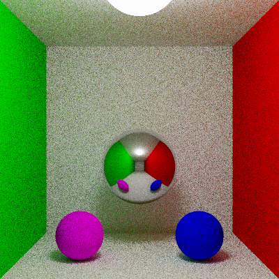

# PhyxRadpp

PhyxRadpp is a modern C++23 ray tracer and image processing utility. Built with performance and modern standards in mind, the project heavily utilizes C++23 modules and the `xmake` build system.

Currently, the engine is capable of processing High Dynamic Range (HDR) images and rendering 3D scenes featuring perspective cameras and mathematical shapes (such as spheres, planes and cubes), and physically based rendering (PBR) through path tracing.

------------------------------------------------------------------------------------------------------------------------------------------------
## Features

* **PFM to PNG Conversion:** Converts HDR `.pfm` image files into standard `.png` files. Includes customizable exposure scaling (alpha factor) and gamma correction.
* **Modular Material System:** Features an extensible architecture for materials and BRDFs. Includes support for UniformPigment (solid colors), CheckeredPigment (procedural grids), and ImagePigment (HDR texture mapping).
* **Multi-Algorithm Ray Tracing:** Renders 3D scenes using interchangeable algorithms. Currently supports:
  - `onoff`: A fast silhouette map of ray-object intersections (default black and white image).
  - `flat`: A flat-shading renderer that resolves surface parameters (UV coordinates) to apply colors and image textures.
  - `pathtracing`: An advanced renderer that numerically solves the rendering equation using Monte Carlo integration and Russian Roulette depth control for photorealistic global illumination.
* **Modern C++23 Architecture:** Fully modularized codebase (`.cppm` files), utilizing the newest features like `std::expected` for safe error handling.

------------------------------------------------------------------------------------------------------------------------------------------------
## Quick Start (Building & Running)

If your system is already set up with a modern C++ compiler, building the project is incredibly simple. Navigate to the folder containing `xmake.lua` and run:
```bash
xmake
```

------------------------------------------------------------------------------------------------------------------------------------------------
## Usage
The executable PhyxRadpp has two main commands: `pfm2png` and `demo`.

### 1. PFM to PNG Converter
Converts an HDR image into a standard PNG.

```bash
xmake run PhyxRadpp pfm2png <INPUT_PFM> <ALPHA_FACTOR> <GAMMA> <OUTPUT_PNG>
```

#### -- Example 1.1: Conversion from `.pfm` to `.png`
Here is a command that converts `images/memorial.pfm` into `memorial_alpha0.2_gamma_1.png`

```bash
xmake run PhyxRadpp pfm2png images/memorial.pfm 0.2 1.0 memorial
```


### 2. Ray Tracing Demo
Renders a 3D scene. You can optionally specify the rendering algorithm, resolution, antialiasing, and path tracing parameters.

```bash
xmake run PhyxRadpp demo <ALPHA_FACTOR> <GAMMA> <OUTPUT_PNG> [FLAGS]
```
**Optional Flags:**
* `--algorithm <type>` : Render engine (`onoff`, `flat`, or `pathtracing`). Default is `flat`.
* `--antialiasing <N>` : Apply anti-aliasing with NxN samples per pixel.
* `--dimensions <W> <H>` : Set output image resolution in pixels (Width Height).
* `--pathtracer_params <rays> <max_depth> <rr_depth>` : Configure PathTracer settings.
  * `<rays>` : Number of Monte Carlo rays emitted per hit.
  * `<max_depth>` : Maximum reflection depth/bounces.
  * `<rr_depth>` : Russian Roulette start depth.

#### Changing the Active Scene & Creating Custom Scenes
Because `PhyxRadpp`
Because PhyxRadpp is designed to be highly modular, scenes are built using dedicated builder functions. To change the scene that gets rendered, open `src/main.cpp` and locate the `run_demo function.

You can easily build and render your own custom 3D environments without altering the core rendering logic by writing a new `build_my_custom_world()` function and calling it in the algorithm selection block.

#### -- Example 2.1: Textured Scene (Flat Shading)
Ensure `World world = build_plane_and_sphere_world();` is active in `main.cpp`.
To render a scene with a textured sphere and a checkered plane using an `alpha=0.3` and `gamma=2.2`:

```bash
xmake run PhyxRadpp demo 0.3 2.2 sphere_plane --algorithm flat
```


#### -- Example 2.2: Silhouette Mode (On/Off)
Ensure `World world = build_10_white_spheres_world();` is active in `main.cpp`.
To render a black-and-white silhouette of the geometry:

```bash
xmake run PhyxRadpp demo 1 1 demo_silhouette --algorithm onoff
```


*Note: if you use the default settings for OnOffRenderer the values of `alpha` and `gamma` are irrelevant. Be careful to set sensible values of `alpha` and `gamma` when you render different colors.*

#### -- Example 2.3: Global Illumination (Path Tracing)
Ensure `World world = build_Cornell_box_world();` is active for the pathtracing algorithm block in `main.cpp`.

To render a photorealistic Cornell Box containing diffusive and mirrored spheres, solving the rendering equation with a 400x400 resolution, 10x10 antialiasing (100 samples per pixel), 4 rays per bounce, a max depth of 4, and Russian Roulette starting at depth 3.

```bash
xmake run PhyxRadpp demo 1 1 Cornell_Box_Sphere_400_400_anti10_path443 --algorithm pathtracing --dimensions 400 400 --antialiasing 10 --pathtracer_params 4 4 3
```



*Note: The code will automatically append _alpha1_gamma1.png to your output filename.*

------------------------------------------------------------------------------------------------------------------------------------------------
## Testing
To build and run the `doctest` unit test suite, simply use:

```bash
xmake test -v
```
Each `.cppm` file has its own tests: to build and run tests for a specific `.cppm` file run
```bash
xmake run test_<FILE_NAME>
```
(Example for `HDRImage`: `xmake run test_HDRImage`)

------------------------------------------------------------------------------------------------------------------------------------------------
## First Time Setup (Dependencies)
If you are compiling this project on a fresh machine, you need a C++23 compatible compiler. `xmake` will automatically download `doctest` and `stb`, but you must provide the compiler.

### 🐧 Linux (Ubuntu)
You need Clang 18 and libc++ for C++23 modules support. Run these commands once:

```bash
sudo apt-get update
sudo apt-get install -y clang-18 libc++-18-dev libc++abi-18-dev clang-tools-18
xmake config --yes --toolchain=clang
```

### 🍎 macOS
Install the official LLVM via Homebrew (Apple Clang lacks full module support):

```bash
brew update
brew install llvm
xmake config --yes
```

### 🪟 Windows
Visual Studio 2022 (MSVC) is fully supported and detected automatically. Just run xmake.
