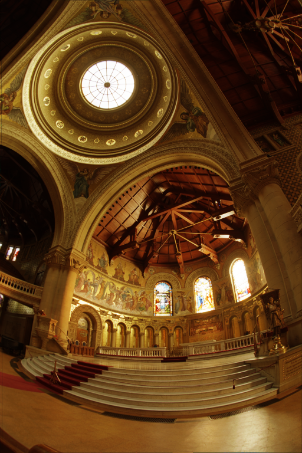
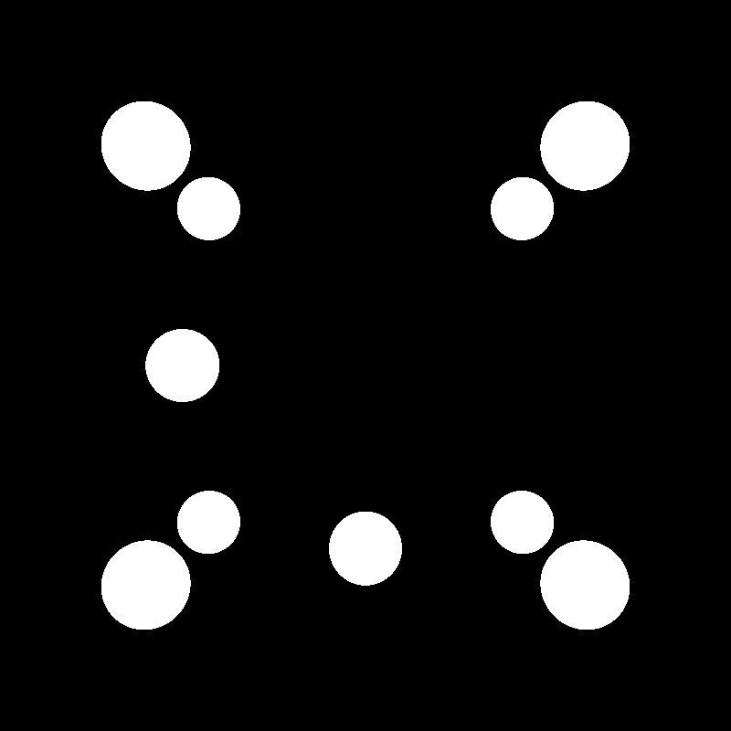
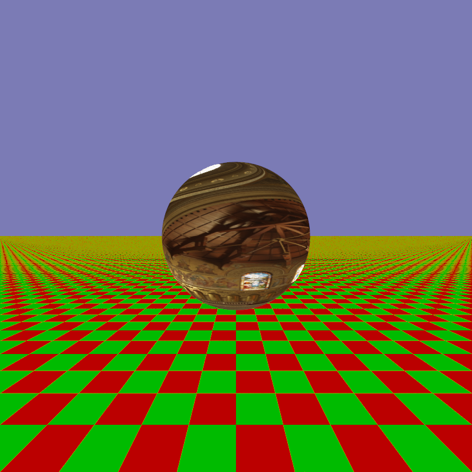
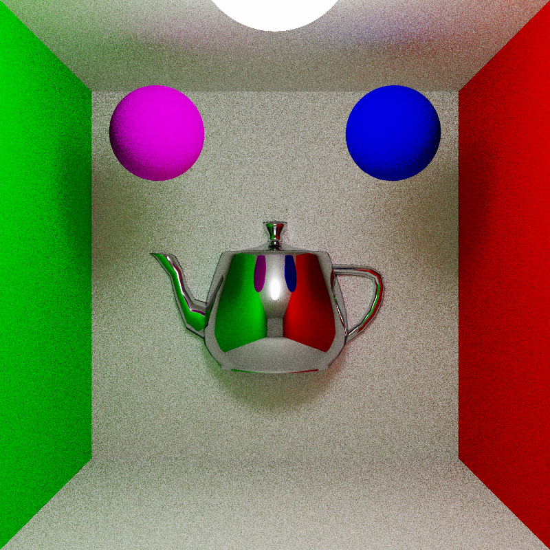
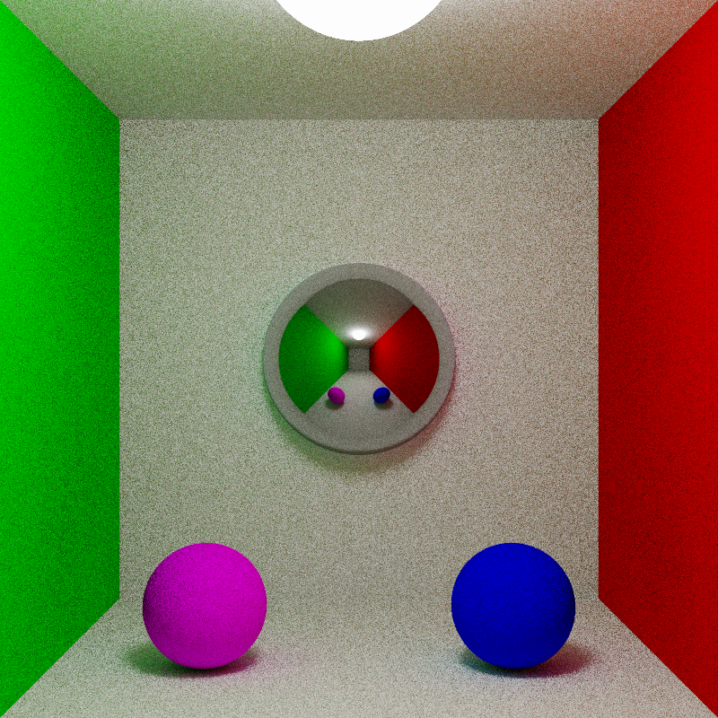

# PhyxRadpp

PhyxRadpp is a C++23 ray tracer and image processing utility built using `xmake`. It supports processing HDR images and rendering 3D scenes using mathematical primitives (spheres, planes, cubes) and OBJ meshes.

Scenes and rendering parameters are parsed dynamically at runtime using a custom LL(1) recursive descent parser, reading from text-based scene description files.

------------------------------------------------------------------------------------------------------------------------------------------------
## Features

* **Scene Parsing:** Scenes are loaded at runtime from `.txt` files, supporting custom variables, material definitions, transformations, and camera positioning.
* **Rendering Algorithms:**
  * `onoff`: Binary hit/miss visibility testing (generates a black-and-white silhouette).
  * `flat`: Flat shading that resolves surface coordinates to apply solid colors or UV-mapped HDR textures without calculating light bounces.
  * `pathtracing`: Physically based rendering using Monte Carlo integration and Russian Roulette depth control to calculate global illumination.
* **Material System:** Supports uniform colors, procedural checkerboards, and HDR image texture mapping attached to diffusive or specular BRDFs.
* **HDR Image Processing:** Converts `.pfm` files to standard `.png` files, applying normalization (alpha) and gamma correction.

------------------------------------------------------------------------------------------------------------------------------------------------
## Building the Project

The project requires a C++23 compatible compiler. Dependencies (`doctest` and `stb`) are handled automatically by `xmake`.

Navigate to the project root, where `xmake.lua` is located, and run:
```bash
xmake
```

------------------------------------------------------------------------------------------------------------------------------------------------
## Usage
The executable PhyxRadpp provides two main commands: `pfm2png` and `demo`.

### 1. PFM to PNG Converter
Converts an HDR image into a standard PNG.

```bash
xmake run PhyxRadpp pfm2png <INPUT_PFM> <ALPHA_FACTOR> <GAMMA> [FLAGS]
```
- Routing: The program automatically looks for the input file in pfm_files/` and saves the output to `png_converted/`.

#### -- Example 1.1: Conversion from `.pfm` to `.png`
Convert `pfm_files/memorial.pfm` using an `alpha=0.3` and a `gamma=1.0.

```bash
xmake run PhyxRadpp pfm2png memorial.pfm 0.3 1.0
```
*(Outputs: `png_converted/memorial_a0.3_g1.png`)*




### 2. Scene Rendering
Renders a 3D scene. You can optionally specify the rendering algorithm, resolution, antialiasing, and path tracing parameters.

**Command**
```bash
xmake run PhyxRadpp render <INPUT_SCENE_TXT> <ALPHA_FACTOR> <GAMMA> [FLAGS]
```
**Optional Flags:**
* `--output <filename>`: Bypasses the automated folder routing/naming and saves the file exactly as specified.
* `--algorithm <type>` : Render engine (`onoff`, `flat`, or `pathtracing`). Default is `flat`.
* `--antialiasing <N>` : Apply anti-aliasing with NxN samples per pixel.
* `--dimensions <W> <H>` : Set output image resolution in pixels (Width Height).
* `--pathtracer_params <rays> <max_depth> <rr_depth>` : Configure PathTracer settings.
  * `<rays>` : Number of Monte Carlo rays emitted per hit.
  * `<max_depth>` : Maximum reflection depth/bounces.
  * `<rr_depth>` : Russian Roulette start depth.

#### -- Example 2.1: Silhouette Mode (On/Off)**
Render the quick black-and-white silhouette map of the geometry in `examples/sphere_silhouette.txt. This is highly useful for checking camera framing without waiting for complex light calculations.
```bash
xmake run PhyxRadpp render sphere_silhouette.txt 1.0 1.0 --algorithm onoff
```


*(Outputs: `generated_images/sphere_silhouette_a1_g1_onoff_800x800.png`)*

*Note: When using the `onoff` renderer, the values of alpha` and `gamma` do not affect the binary output, but must still be provided to satisfy the CLI parameters.*

#### -- Example 2.2: Flat Shading (Textured Scene)
Render `examples/sphere_and_plane.txt` with resolution 800x800 and 4x4 antialiasing.

To render a scene with a textured sphere and a checkered plane using an `alpha=0.3` and `gamma=2.2`:

```bash
xmake run PhyxRadpp render sphere_and_plane.txt 0.3 2.2 --algorithm flat --dimensions 800 800 --antialiasing 4
```

*(Outputs: `generated_images/sphere_and_plane_a0.3_g2.2_flat_800x800_AA4.png`)*




#### -- Example 2.3: Path Tracing (Global Illumination)
Render `examples/cornell_box_teapot.txt` with resolution 800x800, 10x10 antialiasing, using 4 rays per bounce, `max_depth=4`, and Russian Roulette at `depth=3`:

```bash
xmake run PhyxRadpp render cornell_box_teapot.txt 1.0 1.0 --algorithm pathtracing --antialiasing 10 --dimensions 800 800 --pathtracer_params 4 4 3
```



*(Outputs: `generated_images/cornell_box_teapot_a1_g1_pathtracing_800x800_AA10_r4_d4_rr3.png`)*

Another example of this is the rendering of `examples/cornell_box_spheres.txt` with resolution 800x800, 10x10 antialiasing, using 4 rays per bounce, `max_depth=4`, and Russian Roulette at `depth=3`:

```bash
xmake run PhyxRadpp render examples/cornell_box_spheres.txt 1.0 1.0 generated_images/cornell_box_spheres.png --algorithm pathtracing --antialiasing 10 --dimensions 800 800 --pathtracer_params 4 4 3
```

*(Outputs: `generated_images/cornell_box_spheres_a1_g1_pathtracing_800x800_AA10_r4_d4_rr3.png`)*



#### -- Example 2.4: Custom Output
Render a scene and manually define the exact output path. 
This is the rendering of `examples/utah_teapot.txt`.

```bash
xmake run PhyxRadpp render utah_teapot.txt 1.0 1.0 --algorithm flat --output my_custom_output_path/custom_test_render.png
```

*(Outputs: `my_custom_output_path/custom_test_render.png`)*


------------------------------------------------------------------------------------------------------------------------------------------------
## Scene Description Language

`PhyxRadpp` uses a custom, easily readable text format to define 3D environments at runtime. You can define variables, build complex BRDF materials, and chain matrix transformations.

Here is a quick example of a scene file:
```text
# Define variables
float pi = 3.14159;

# Set environment and camera
background(<0.5, 0.7, 1.0>);
camera(perspective, 1.0, 3.0, translation([0.0, 0.0, 5.0]));

# Build a material and apply it to a shape
material red_plastic(diffuse(uniform(<0.8, 0.1, 0.1>)));
sphere(translation([0.0, 1.0, 0.0]) * scaling([2.0, 2.0, 2.0]), red_plastic);
```
For a complete guide on all available shapes, materials, and syntax rules, please see the Scene Language Documentation in `docs/SCENE_LANGUAGE.md`.

------------------------------------------------------------------------------------------------------------------------------------------------
## Testing
To build and run the `doctest` unit test suite, simply use:

```bash
xmake test -v
```
To run tests for a specific module (e.g., `HDRImage):
```bash
xmake run test_HDRImage
```

------------------------------------------------------------------------------------------------------------------------------------------------
## First Time Setup (Dependencies)
If you are compiling this project on a fresh machine, you need a C++23 compatible compiler. `xmake` will automatically download `doctest` and `stb`, but you must provide the compiler.

### 🐧 Linux (Ubuntu)
You need Clang 18 and libc++ for C++23 modules support. Run these commands once:

```bash
sudo apt-get update
sudo apt-get install -y clang-18 libc++-18-dev libc++abi-18-dev clang-tools-18
xmake config --yes --toolchain=clang
```

### 🍎 macOS
Install the official LLVM via Homebrew (Apple Clang lacks full module support):

```bash
brew update
brew install llvm
xmake config --yes
```

### 🪟 Windows
Visual Studio 2022 (MSVC) is fully supported and detected automatically. Just run xmake.
